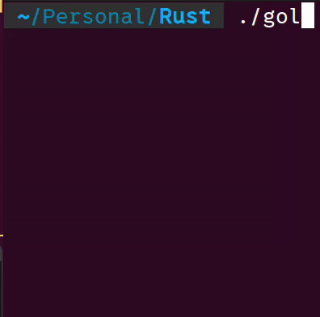

### Simple Game of Life Implementation in Rust for the terminal.

This is a simple implementation of [Conway's Game of Life](https://en.wikipedia.org/wiki/Conway%27s_Game_of_Life) written in Rust, that prints a glider to the terminal.



##### Compile:

```console
rustc gol.rs
```

##### Run:

```console
./gol
```
